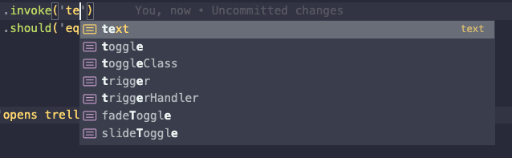
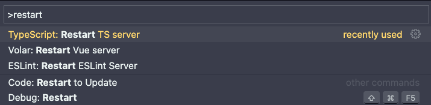

# Writing tests with Cypress

## Autocompletion
With TypeScript support in Cypress, we get autocompleting features for the whole Cypress API. This can guide us with finding options or arguments that our commands can take. E.g. `.invoke()` command will nicely autocomplete when we start typing:



## Plugin support
Many plugins come with TypeScript support. This means that we get all the type checking as with other commands. After installing and importing commands, it is important to include their type declarations in `tsconfig.json` file:
```json
"types": [
  "cypress",
  "node",
  "cypress-grep" // plugin name
]
```

The changes we do in `tsconfig.json` can sometimes take a moment to appear. To speed this up or unstuck our code editor, restarting TypeScript often helps.



## Data driven testing
When iterating over a JSON file to generate the test flow, TypeScript can be a big help. Once our file is imported, types are often inferred from the content of the file automatically.

## Defining paths
Resolving paths is sometimes a lot of work. With TypeScript, you can remove the hassle by defining path aliases in `tsconfig.json` file. These mean that you can import your files from anywhere, no matter where you are in the project tree.

```js
"paths": {
  "@fixtures/*": [
    "./cypress/fixtures/*"
  ]
}
```

## Using types from source code
You can tie up your source code and your test code more closely. For example, you can use types from your source code in your tests and cast them as return value of `.request()` command. 

```ts
cy.request<Board>('POST', '/api/boards', { name })
```

If anything changes in the source, this will become immediately visible in your tests.

## Useful reading
- [How to define paths in TypeScript](https://www.typescriptlang.org/tsconfig#paths)
- [Type casting](https://www.typescripttutorial.net/typescript-tutorial/type-casting/)
- [Using JSON fixtures in Cypress TypeScript tests](https://glebbahmutov.com/blog/cypress-js-to-ts/#step-12-use-json-fixtures)